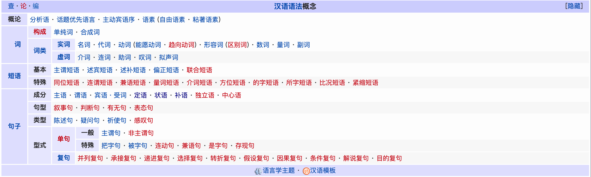

# TOEIC

`TOEIC` Grammar

## 目录

- [TOEIC](#toeic)
  - [目录](#目录)
  - [汉语中的语法概念](#汉语中的语法概念)
  - [句子](#句子)
    - [主语 **S**](#主语-s)
    - [谓语 **V**](#谓语-v)
    - [宾语 **O**](#宾语-o)
    - [补语 **C**](#补语-c)
  - [修饰成分 **M**](#修饰成分-m)
  - [动词](#动词)

## 汉语中的语法概念

<table cellspacing="0" class="navbox" style="border-spacing:0"><tbody><tr><td style="padding:2px"><table cellspacing="0" class="nowraplinks collapsible autocollapse navbox-inner" style="border-spacing:0;background:transparent;color:inherit" id="collapsibleTable0"><tbody><tr><th scope="col" class="navbox-title" colspan="2">[<a id="collapseButton0" href="#">隐藏</a>]
<ul><li class="nv-view"><a href="/wiki/Template:%E6%BC%A2%E8%AA%9E%E8%AA%9E%E6%B3%95%E6%A6%82%E5%BF%B5" title="Template:汉语语法概念"><abbr title="查看该模板" style=";;background:none transparent;border:none;">查</abbr></a></li><li class="nv-talk"><a href="/w/index.php?title=Template_talk:%E6%BC%A2%E8%AA%9E%E8%AF%AD%E6%B3%95%E6%A6%82%E5%BF%B5&amp;action=edit&amp;redlink=1" class="new" title="Template talk:汉语语法概念（页面不存在）"><abbr title="讨论该模板" style=";;background:none transparent;border:none;">论</abbr></a></li><li class="nv-edit"><a class="external text" href="https://zh.wikipedia.org/w/index.php?title=Template:%E6%BC%A2%E8%AA%9E%E8%AF%AD%E6%B3%95%E6%A6%82%E5%BF%B5&amp;action=edit"><abbr title="编辑该模板" style=";;background:none transparent;border:none;">编</abbr></a></li></ul>

<a href="/wiki/%E6%B1%89%E8%AF%AD%E8%AF%AD%E6%B3%95" title="汉语语法">汉语语法</a>概念
</th></tr><tr style="height:2px"><td colspan="3"></td></tr><tr><th scope="row" class="navbox-group">概论</th><td class="navbox-list navbox-odd hlist" style="text-align:left;border-left-width:2px;border-left-style:solid;width:100%;padding:0px">

<ul><li><a href="/wiki/%E5%88%86%E6%9E%90%E8%AF%AD" title="分析语">分析语</a></li>
<li><a href="/wiki/%E8%A9%B1%E9%A1%8C%E5%84%AA%E5%85%88%E8%AA%9E%E8%A8%80" class="mw-redirect" title="话题优先语言">话题优先语言</a></li>
<li><a href="/wiki/%E4%B8%BB%E5%8B%95%E8%B3%93%E8%AA%9E%E5%BA%8F" title="主动宾语序">主动宾语序</a></li>
<li><a href="/wiki/%E8%AA%9E%E7%B4%A0" title="语素">语素</a>
<ul><li><a href="/wiki/%E8%87%AA%E7%94%B1%E8%A9%9E%E7%B4%A0" title="自由词素">自由语素</a></li>
<li><a href="/wiki/%E8%A6%8F%E7%AF%84%E8%A9%9E%E7%B4%A0" class="mw-redirect" title="规范词素">粘著语素</a></li></ul></li></ul>

</td></tr><tr style="height:2px"><td colspan="3"></td></tr><tr><th scope="row" class="navbox-group"><a href="/wiki/%E8%A9%9E%E8%AA%9E" class="mw-redirect" title="词语">词</a></th><td class="navbox-list navbox-even hlist" style="text-align:left;border-left-width:2px;border-left-style:solid;width:100%;padding:0px">

<table cellspacing="0" class="nowraplinks navbox-subgroup" style="border-spacing:0"><tbody><tr><th scope="row" class="navbox-group" style="padding-left:0em;padding-right:0em;">
<a href="/w/index.php?title=%E6%BC%A2%E8%AA%9E%E6%A7%8B%E8%A9%9E%E6%B3%95&amp;action=edit&amp;redlink=1" class="new" title="汉语构词法（页面不存在）">构成</a>
</th><td class="navbox-list navbox-odd" style="text-align:left;border-left-width:2px;border-left-style:solid;width:100%;padding:0px">

<ul><li><a href="/wiki/%E5%8D%95%E7%BA%AF%E8%AF%8D" title="单纯词">单纯词</a></li>
<li><a href="/wiki/%E5%90%88%E6%88%90%E8%AF%8D" title="合成词">合成词</a></li></ul>

</td></tr><tr style="height:2px"><td colspan="3"></td></tr><tr><th scope="row" class="navbox-group" style="padding-left:0em;padding-right:0em;">
<a href="/wiki/%E6%B1%89%E8%AF%AD%E8%AF%8D%E7%B1%BB" title="汉语词类">词类</a>
</th><td class="navbox-list navbox-even" style="text-align:left;border-left-width:2px;border-left-style:solid;width:100%;padding:0px">

<table cellspacing="0" class="nowraplinks navbox-subgroup" style="border-spacing:0"><tbody><tr><th scope="row" class="navbox-group" style="padding-left:0em;padding-right:0em;">
<a href="/wiki/%E5%AE%9E%E8%AF%8D" title="实词">实词</a>
</th><td class="navbox-list navbox-odd" style="text-align:left;border-left-width:2px;border-left-style:solid;width:100%;padding:0px">

<ul><li><a href="/wiki/%E5%90%8D%E8%A9%9E" title="名词">名词</a></li>
<li><a href="/wiki/%E6%B1%89%E8%AF%AD%E4%BA%BA%E7%A7%B0%E4%BB%A3%E8%AF%8D" title="汉语人称代词">代词</a></li>
<li><a href="/wiki/%E5%8B%95%E8%A9%9E" class="mw-redirect" title="动词">动词</a>
<ul><li><a href="/wiki/%E8%83%BD%E6%84%BF%E5%8A%A8%E8%AF%8D" title="能愿动词">能愿动词</a></li>
<li><a href="/w/index.php?title=%E8%B6%A8%E5%90%91%E5%8B%95%E8%A9%9E&amp;action=edit&amp;redlink=1" class="new" title="趋向动词（页面不存在）">趋向动词</a></li></ul></li>
<li><a href="/wiki/%E5%BD%A2%E5%AE%B9%E8%AF%8D" title="形容词">形容词</a>
<ul><li><a href="/w/index.php?title=%E5%8C%BA%E5%88%AB%E8%AF%8D&amp;action=edit&amp;redlink=1" class="new" title="区别词（页面不存在）">区别词</a></li></ul></li>
<li><a href="/wiki/%E6%95%B8%E8%A9%9E" title="数词">数词</a></li>
<li><a href="/wiki/%E6%B1%89%E8%AF%AD%E9%87%8F%E8%AF%8D" title="汉语量词">量词</a></li>
<li><a href="/wiki/%E5%89%AF%E8%A9%9E" title="副词">副词</a></li></ul>

</td></tr><tr style="height:2px"><td colspan="3"></td></tr><tr><th scope="row" class="navbox-group" style="padding-left:0em;padding-right:0em;">
<a href="/wiki/%E8%99%9A%E8%AF%8D" title="虚词">虚词</a>
</th><td class="navbox-list navbox-even" style="text-align:left;border-left-width:2px;border-left-style:solid;width:100%;padding:0px">

<ul><li><a href="/wiki/%E4%BB%8B%E8%A9%9E" title="介词">介词</a></li>
<li><a href="/wiki/%E9%80%A3%E8%A9%9E" title="连词">连词</a></li>
<li><a href="/wiki/%E5%8A%A9%E8%A9%9E" title="助词">助词</a></li>
<li><a href="/wiki/%E5%8F%B9%E8%AF%8D" class="mw-redirect" title="叹词">叹词</a></li>
<li><a href="/wiki/%E6%93%AC%E8%81%B2%E8%A9%9E" title="拟声词">拟声词</a></li></ul>

</td></tr></tbody></table>

</td></tr></tbody></table>

</td></tr><tr style="height:2px"><td colspan="3"></td></tr><tr><th scope="row" class="navbox-group"><a href="/wiki/%E8%AF%8D%E7%BB%84" class="mw-redirect" title="词组">短语</a></th><td class="navbox-list navbox-odd hlist" style="text-align:left;border-left-width:2px;border-left-style:solid;width:100%;padding:0px">

<table cellspacing="0" class="nowraplinks navbox-subgroup" style="border-spacing:0"><tbody><tr><th scope="row" class="navbox-group" style="padding-left:0em;padding-right:0em;">
基本
</th><td class="navbox-list navbox-odd" style="text-align:left;border-left-width:2px;border-left-style:solid;width:100%;padding:0px">

<ul><li><a href="/wiki/%E4%B8%BB%E8%AC%82%E7%9F%AD%E8%AA%9E" title="主谓短语">主谓短语</a></li>
<li><a href="/wiki/%E8%BF%B0%E8%B3%93%E7%9F%AD%E8%AA%9E" title="述宾短语">述宾短语</a></li>
<li><a href="/wiki/%E8%BF%B0%E8%A3%9C%E7%9F%AD%E8%AA%9E" title="述补短语">述补短语</a></li>
<li><a href="/wiki/%E5%81%8F%E6%AD%A3%E7%9F%AD%E8%AA%9E" title="偏正短语">偏正短语</a></li>
<li><a href="/w/index.php?title=%E8%81%AF%E5%90%88%E7%9F%AD%E8%AA%9E&amp;action=edit&amp;redlink=1" class="new" title="联合短语（页面不存在）">联合短语</a></li></ul>

</td></tr><tr style="height:2px"><td colspan="3"></td></tr><tr><th scope="row" class="navbox-group" style="padding-left:0em;padding-right:0em;">
特殊
</th><td class="navbox-list navbox-even" style="text-align:left;border-left-width:2px;border-left-style:solid;width:100%;padding:0px">

<ul><li><a href="/w/index.php?title=%E5%90%8C%E4%BD%8D%E7%9F%AD%E8%AA%9E&amp;action=edit&amp;redlink=1" class="new" title="同位短语（页面不存在）">同位短语</a></li>
<li><a href="/w/index.php?title=%E9%80%A3%E8%AC%82%E7%9F%AD%E8%AA%9E&amp;action=edit&amp;redlink=1" class="new" title="连谓短语（页面不存在）">连谓短语</a></li>
<li><a href="/w/index.php?title=%E5%85%BC%E8%AA%9E%E7%9F%AD%E8%AA%9E&amp;action=edit&amp;redlink=1" class="new" title="兼语短语（页面不存在）">兼语短语</a></li>
<li><a href="/w/index.php?title=%E9%87%8F%E8%A9%9E%E7%9F%AD%E8%AA%9E&amp;action=edit&amp;redlink=1" class="new" title="量词短语（页面不存在）">量词短语</a></li>
<li><a href="/w/index.php?title=%E4%BB%8B%E8%A9%9E%E7%9F%AD%E8%AA%9E&amp;action=edit&amp;redlink=1" class="new" title="介词短语（页面不存在）">介词短语</a></li>
<li><a href="/w/index.php?title=%E6%96%B9%E4%BD%8D%E7%9F%AD%E8%AA%9E&amp;action=edit&amp;redlink=1" class="new" title="方位短语（页面不存在）">方位短语</a></li>
<li><a href="/w/index.php?title=%E7%9A%84%E5%AD%97%E7%9F%AD%E8%AA%9E&amp;action=edit&amp;redlink=1" class="new" title="的字短语（页面不存在）">的字短语</a></li>
<li><a href="/w/index.php?title=%E6%89%80%E5%AD%97%E7%9F%AD%E8%AA%9E&amp;action=edit&amp;redlink=1" class="new" title="所字短语（页面不存在）">所字短语</a></li>
<li><a href="/w/index.php?title=%E6%AF%94%E6%B3%81%E7%9F%AD%E8%AA%9E&amp;action=edit&amp;redlink=1" class="new" title="比况短语（页面不存在）">比况短语</a></li>
<li><a href="/w/index.php?title=%E7%B7%8A%E7%B8%AE%E7%9F%AD%E8%AA%9E&amp;action=edit&amp;redlink=1" class="new" title="紧缩短语（页面不存在）">紧缩短语</a></li></ul>

</td></tr></tbody></table>

</td></tr><tr style="height:2px"><td colspan="3"></td></tr><tr><th scope="row" class="navbox-group"><a href="/wiki/%E5%8F%A5%E5%AD%90" title="句子">句子</a></th><td class="navbox-list navbox-even hlist" style="text-align:left;border-left-width:2px;border-left-style:solid;width:100%;padding:0px">

<table cellspacing="0" class="nowraplinks navbox-subgroup" style="border-spacing:0"><tbody><tr><th scope="row" class="navbox-group" style="padding-left:0em;padding-right:0em;">
成分
</th><td class="navbox-list navbox-odd" style="text-align:left;border-left-width:2px;border-left-style:solid;width:100%;padding:0px">

<ul><li><a href="/wiki/%E4%B8%BB%E8%AA%9E" title="主语">主语</a></li>
<li><a href="/wiki/%E8%AC%82%E8%AA%9E" title="谓语">谓语</a></li>
<li><a href="/wiki/%E8%B3%93%E8%AA%9E" title="宾语">宾语・受词</a></li>
<li><a href="/wiki/%E5%AE%9A%E8%AA%9E" title="定语">定语</a></li>
<li><a href="/wiki/%E7%8B%80%E8%AA%9E" title="状语">状语</a></li>
<li><a href="/wiki/%E8%A3%9C%E8%AA%9E" class="mw-redirect" title="补语">补语</a></li>
<li><a href="/w/index.php?title=%E7%8D%A8%E7%AB%8B%E8%AA%9E&amp;action=edit&amp;redlink=1" class="new" title="独立语（页面不存在）">独立语</a></li>
<li><a href="/w/index.php?title=%E4%B8%AD%E5%BF%83%E8%AA%9E&amp;action=edit&amp;redlink=1" class="new" title="中心语（页面不存在）">中心语</a></li></ul>

</td></tr><tr style="height:2px"><td colspan="3"></td></tr><tr><th scope="row" class="navbox-group" style="padding-left:0em;padding-right:0em;">
句型
</th><td class="navbox-list navbox-even" style="text-align:left;border-left-width:2px;border-left-style:solid;width:100%;padding:0px">

<ul><li><a href="/w/index.php?title=%E6%95%98%E4%BA%8B%E5%8F%A5&amp;action=edit&amp;redlink=1" class="new" title="叙事句（页面不存在）">叙事句</a></li>
<li><a href="/w/index.php?title=%E5%88%A4%E6%96%B7%E5%8F%A5&amp;action=edit&amp;redlink=1" class="new" title="判断句（页面不存在）">判断句</a></li>
<li><a href="/w/index.php?title=%E6%9C%89%E7%84%A1%E5%8F%A5&amp;action=edit&amp;redlink=1" class="new" title="有无句（页面不存在）">有无句</a></li>
<li><a href="/w/index.php?title=%E8%A1%A8%E6%85%8B%E5%8F%A5&amp;action=edit&amp;redlink=1" class="new" title="表态句（页面不存在）">表态句</a></li></ul>

</td></tr><tr style="height:2px"><td colspan="3"></td></tr><tr><th scope="row" class="navbox-group" style="padding-left:0em;padding-right:0em;">
类型
</th><td class="navbox-list navbox-odd" style="text-align:left;border-left-width:2px;border-left-style:solid;width:100%;padding:0px">

<ul><li><a href="/wiki/%E9%99%B3%E8%BF%B0%E5%8F%A5" title="陈述句">陈述句</a></li>
<li><a href="/wiki/%E7%96%91%E5%95%8F%E5%8F%A5" title="疑问句">疑问句</a></li>
<li><a href="/wiki/%E7%A5%88%E4%BD%BF%E8%AA%9E%E6%B0%A3" title="祈使语气">祈使句</a></li>
<li><a href="/w/index.php?title=%E6%84%9F%E5%98%86%E5%8F%A5&amp;action=edit&amp;redlink=1" class="new" title="感叹句（页面不存在）">感叹句</a></li></ul>

</td></tr><tr style="height:2px"><td colspan="3"></td></tr><tr><th scope="row" class="navbox-group" style="padding-left:0em;padding-right:0em;">
型式
</th><td class="navbox-list navbox-even" style="text-align:left;border-left-width:2px;border-left-style:solid;width:100%;padding:0px">

<table cellspacing="0" class="nowraplinks navbox-subgroup" style="border-spacing:0"><tbody><tr><th scope="row" class="navbox-group" style="padding-left:0em;padding-right:0em;">
<a href="/w/index.php?title=%E5%96%AE%E5%8F%A5&amp;action=edit&amp;redlink=1" class="new" title="单句（页面不存在）">单句</a>
</th><td class="navbox-list navbox-odd" style="text-align:left;border-left-width:2px;border-left-style:solid;width:100%;padding:0px">

<table cellspacing="0" class="nowraplinks navbox-subgroup" style="border-spacing:0"><tbody><tr><th scope="row" class="navbox-group" style="padding-left:0em;padding-right:0em;">
一般
</th><td class="navbox-list navbox-odd" style="text-align:left;border-left-width:2px;border-left-style:solid;width:100%;padding:0px">

<ul><li><a href="/wiki/%E4%B8%BB%E8%B0%93%E5%8F%A5" title="主谓句">主谓句</a></li>
<li><a href="/w/index.php?title=%E9%9D%9E%E4%B8%BB%E8%AC%82%E5%8F%A5&amp;action=edit&amp;redlink=1" class="new" title="非主谓句（页面不存在）">非主谓句</a></li></ul>

</td></tr><tr style="height:2px"><td colspan="3"></td></tr><tr><th scope="row" class="navbox-group" style="padding-left:0em;padding-right:0em;">
特殊
</th><td class="navbox-list navbox-even" style="text-align:left;border-left-width:2px;border-left-style:solid;width:100%;padding:0px">

<ul><li><a href="/wiki/%E6%8A%8A%E5%AD%97%E5%8F%A5" title="把字句">把字句</a></li>
<li><a href="/wiki/%E8%A2%AB%E5%AD%97%E5%8F%A5" title="被字句">被字句</a></li>
<li><a href="/w/index.php?title=%E9%80%A3%E5%8B%95%E5%8F%A5&amp;action=edit&amp;redlink=1" class="new" title="连动句（页面不存在）">连动句</a></li>
<li><a href="/w/index.php?title=%E5%85%BC%E8%AA%9E%E5%8F%A5&amp;action=edit&amp;redlink=1" class="new" title="兼语句（页面不存在）">兼语句</a></li>
<li><a href="/w/index.php?title=%E6%98%AF%E5%AD%97%E5%8F%A5&amp;action=edit&amp;redlink=1" class="new" title="是字句（页面不存在）">是字句</a></li>
<li><a href="/w/index.php?title=%E5%AD%98%E7%8F%BE%E5%8F%A5&amp;action=edit&amp;redlink=1" class="new" title="存现句（页面不存在）">存现句</a></li></ul>

</td></tr></tbody></table>

</td></tr><tr style="height:2px"><td colspan="3"></td></tr><tr><th scope="row" class="navbox-group" style="padding-left:0em;padding-right:0em;">
<a href="/wiki/%E8%A4%87%E5%8F%A5" title="复句">复句</a>
</th><td class="navbox-list navbox-even" style="text-align:left;border-left-width:2px;border-left-style:solid;width:100%;padding:0px">

<ul><li><a href="/w/index.php?title=%E4%B8%A6%E5%88%97%E8%A4%87%E5%8F%A5&amp;action=edit&amp;redlink=1" class="new" title="并列复句（页面不存在）">并列复句</a></li>
<li><a href="/w/index.php?title=%E6%89%BF%E6%8E%A5%E8%A4%87%E5%8F%A5&amp;action=edit&amp;redlink=1" class="new" title="承接复句（页面不存在）">承接复句</a></li>
<li><a href="/w/index.php?title=%E9%81%9E%E9%80%B2%E8%A4%87%E5%8F%A5&amp;action=edit&amp;redlink=1" class="new" title="递进复句（页面不存在）">递进复句</a></li>
<li><a href="/w/index.php?title=%E9%81%B8%E6%93%87%E8%A4%87%E5%8F%A5&amp;action=edit&amp;redlink=1" class="new" title="选择复句（页面不存在）">选择复句</a></li>
<li><a href="/w/index.php?title=%E8%BD%89%E6%8A%98%E8%A4%87%E5%8F%A5&amp;action=edit&amp;redlink=1" class="new" title="转折复句（页面不存在）">转折复句</a></li>
<li><a href="/w/index.php?title=%E5%81%87%E8%A8%AD%E8%A4%87%E5%8F%A5&amp;action=edit&amp;redlink=1" class="new" title="假设复句（页面不存在）">假设复句</a></li>
<li><a href="/w/index.php?title=%E5%9B%A0%E6%9E%9C%E8%A4%87%E5%8F%A5&amp;action=edit&amp;redlink=1" class="new" title="因果复句（页面不存在）">因果复句</a></li>
<li><a href="/w/index.php?title=%E6%A2%9D%E4%BB%B6%E8%A4%87%E5%8F%A5&amp;action=edit&amp;redlink=1" class="new" title="条件复句（页面不存在）">条件复句</a></li>
<li><a href="/w/index.php?title=%E8%A7%A3%E8%AA%AA%E8%A4%87%E5%8F%A5&amp;action=edit&amp;redlink=1" class="new" title="解说复句（页面不存在）">解说复句</a></li>
<li><a href="/w/index.php?title=%E7%9B%AE%E7%9A%84%E8%A4%87%E5%8F%A5&amp;action=edit&amp;redlink=1" class="new" title="目的复句（页面不存在）">目的复句</a></li></ul>

</td></tr></tbody></table>

</td></tr></tbody></table>

</td></tr><tr style="height:2px"><td colspan="3"></td></tr><tr><td class="navbox-abovebelow" colspan="2">
<a href="/wiki/Portal:%E8%AA%9E%E8%A8%80%E5%AD%B8" class="mw-redirect" title="Portal:语言学">语言学主题</a> · <a href="/wiki/Template:%E6%BC%A2%E8%AA%9E" class="mw-redirect" title="Template:汉语">汉语模板</a>
</td></tr></tbody></table></td></tr></tbody></table>

## 句子

- 句子成分
  - 主语
  - 谓语
  - 宾语・受词
  - 定语
  - 状语
  - 补语
  - 独立语
  - 中心语

### 主语 **S**

在一个句子中，主语（或主词）（英语：Subject）是必要的句子元素（Sentence element）。它也是句子两大部分之一；另一部分是谓语或受词（Predicate）。主语是句子元素，不要与文法上词性混淆。

[wikipedia](https://zh.wikipedia.org/wiki/%E4%B8%BB%E8%AA%9E)

### 谓语 **V**

谓语（predicate of grammar）与主语相对，两者是陈述与被陈述的关系。谓语则用来对主语或主词加以陈述，来说明主语“是什么”“做什么”或“怎么样”。
譬如：

1. 在“这个球是黄色的”这句中，“这个球”是主词，“是黄色的”是谓语，“是”字是动词，“黄色的”是表语。
1. 在“他正在打篮球”这句中，“他”是主词，“正在打篮球”是谓语，“打”是动词，“篮球”是宾语。

[wikipedia](https://zh.wikipedia.org/wiki/%E8%AC%82%E8%AA%9E)

### 宾语 **O**

宾语或称受词（英语：Object），是指一个动作（动词）的接受者。例句“我写作业”中，作业即为宾语。
宾语分为宾格和与格两大类，其中直接宾语指动作的直接对象，间接宾语说明动作的非直接，但受动作影响的对b象，一般而言，及物动词后面最少要有一个宾语，而该宾语通常为直接宾语，有些及物动词要求两个宾语，则它们通常一个为宾格，另一个为与格。

[wikipedia](https://zh.wikipedia.org/wiki/%E8%B3%93%E8%AA%9E)

### 补语 **C**

英语补语的作用对象是主语和宾语，具有鲜明的定语性描写或限制性功能，在句法上是不可或缺的。补语是起补充说明作用的成分。最常见的是宾语补足语。名词、动名词、形容词、副词、不定词、现在分词、过去分词都可以在句子中作宾补。

[wikipedia](https://zh.wikipedia.org/wiki/补语)

## 修饰成分 **M**

## 动词

----

- 就像我说的，总是在断断续续的学习
- 花了30天却只看了16天的内容
- 继续努力
- 2017-12-27 时间总是在不经意见溜走，给自己的个人说明里写上一段话。
  - 可笑的那种：一生努力，一生被爱，想要的都拥有，得不到的都释怀。（自己觉得愚蠢的地方就是——一生，这个概念太长，很多人都不知道，一生该如何安排，怎样才算不负此生，包括我个人）
  - 给自己一个神奇的小目标：2100年（希望能活那么久，为什么呢，因为多次看教父这么电影后收获一次比一次多。老教父临终前对迈克说：生活是多么的美好。）
  - 如果既不愿意承担风险，又想改变现状，患得患失的心态，最终什么也得不到。
  - </2017> <2018> Hello 2018!
- `Happy new year`
- Remember to follow your heart.
- I'm just trying to make some difference.
- My destination is live and make some difference, so I need to learn and take chance, don't limit myself, both mind and reality. Remember to enjoy you life, because, you only live one life.
- YOLO
- edit by iPhone lol.
- if I lose myself I loss it all
- Everything that kills me makes feel alive.
- 买了三四本书，汤哥宇哥
- We got to decide what our story is ,Nobody else gets to tell you what your story is
- 美联英语开课啦
- 剁手托福啦
